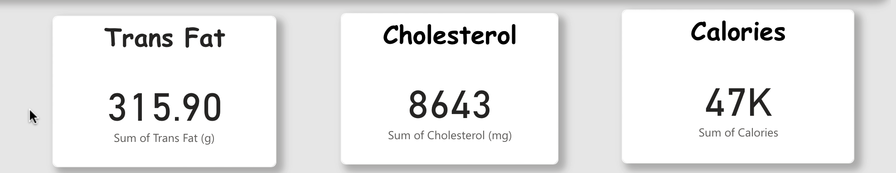
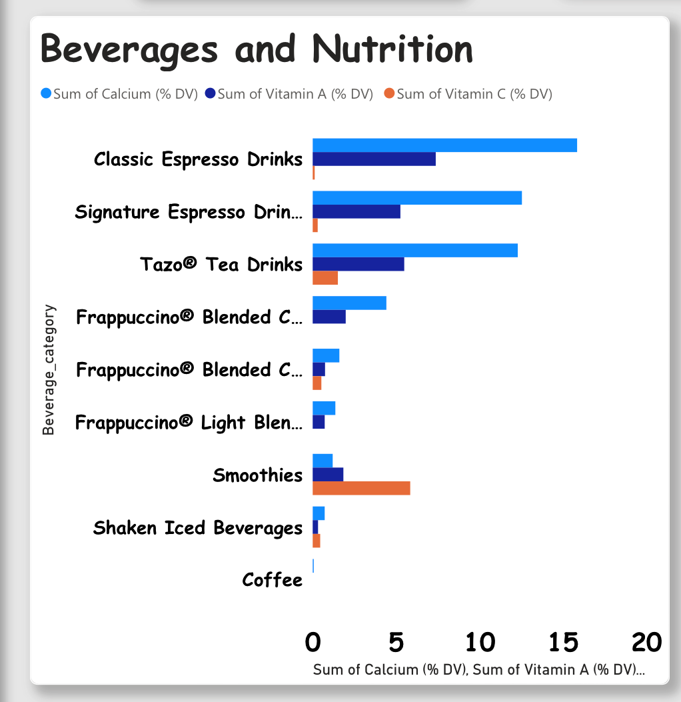
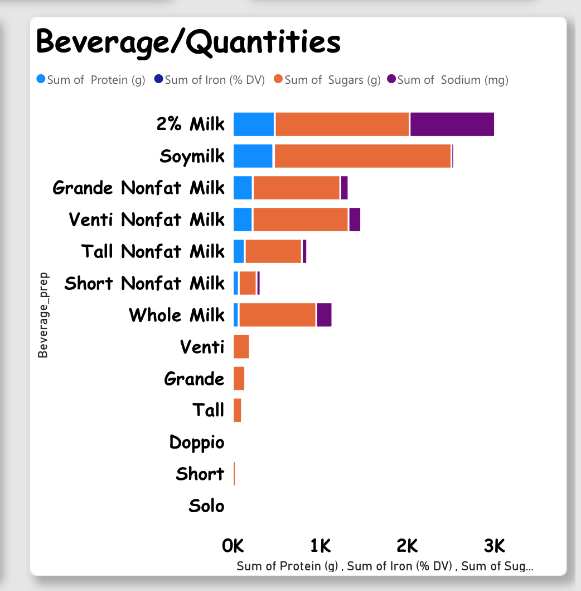
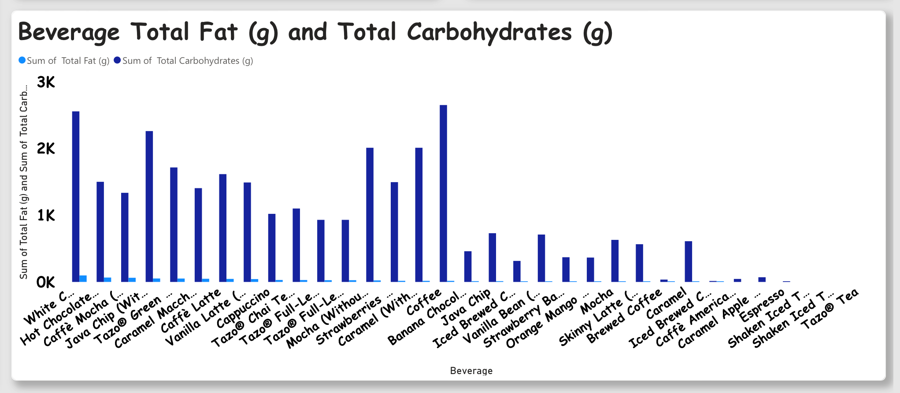

# STARBUCKS BEVERAGE ANALYSIS 

# QUESTIONS 

## Key Performance Indicators (KPIs)

   
•	What are the total amounts of Trans Fat, Calories, and Cholesterol in the Starbucks beverages?

•	How can we visually represent these KPIs to quickly grasp the overall nutritional impact of Starbucks beverages?

## Clustered Bar Chart (Beverage Category vs. Sum of Nutrition):
   

•	What is the distribution of key nutrients (Calcium, Vitamin A, Vitamin C) across different beverage categories?

•	How do the nutritional components vary between various Starbucks beverage categories?

## Stacked Bar Chart (Beverage Prep vs. Sum of Protein, Iron, Sugar, Sodium):
   

•	How does the nutritional content (Protein, Iron, Sugar, Sodium) differ across various beverage preparations?

•	Can we represent the contribution of individual nutrients within each beverage preparation?

## Clustered Column Chart (Beverage vs. Total Fat and Total Carbohydrate):
   
   
•	What is the comparative analysis of Total Fat and Total Carbohydrate content in different Starbucks beverages?

•	How do these macronutrients contribute to the overall nutritional profile of each beverage?

## OBJECTIVES

The project's objective is to conduct a thorough nutritional analysis of Starbucks beverages, employing key performance indicators (KPIs) and diverse visualization techniques. The focus includes calculating total Trans Fat, Calories, and Cholesterol, and representing them through a Clustered Bar Chart for quick insights. Additional visualizations explore nutrient distributions across beverage categories, variations in nutritional components between preparations, and contributions of individual nutrients. Comparative analyses of Total Fat and Total Carbohydrate in different beverages, presented via a Clustered Column Chart, aim to reveal nutritional patterns. By achieving these objectives, the project aims to offer a comprehensive and visually intuitive understanding of Starbucks beverages' nutritional profiles, facilitating informed dietary decisions for consumers and researchers alike.

## METHOD

In my project, I employed Microsoft Power BI to craft an interactive dashboard for the Starbucks beverage dataset. Utilizing KPIs, clustered bar charts, stacked bar charts, and clustered column charts, I visually explored nutrition, nutrient distribution, and macronutrient contributions.
PROCESS

## KPI Section (Trans Fat, Calories, Cholesterol):

## FINDINGS

The Key Performance Indicator (KPI) illustrates the cumulative values of Trans Fat, Cholesterol, and Calories. The purpose of this KPI is to showcase the combined Trans Fat, Cholesterol, and Caloric content of a chosen beverage or a selection of beverages. In this scenario, the total summation is calculated for all the selected beverages.

## Clustered Bar Chart (Beverage Category vs. Sum of Nutrition):

 

## FINDINGS

The distribution of key nutrients (Calcium, Vitamin A, Vitamin C) across various Starbucks beverage categories showcases distinct patterns. Classic Espresso Drinks lead in Calcium at 15.86, while Smoothies excel in Vitamin C at 5.85. Signature Espresso Drinks and Tazo® Tea Drinks demonstrate noteworthy contributions to Vitamin A. The data indicates that different beverage categories have unique nutritional profiles, enabling consumers to make informed choices based on their desires.

## Stacked Bar Chart (Beverage Prep vs. Sum of Protein, Iron, Sugar, Sodium):

 

## FINDINGS

The Starbucks data highlights substantial variations in nutritional content across beverage preparations. For instance, 2% Milk boasts the highest metrics: 481.00g Protein, 2.28% DV Iron, 1549g Sugars, and 980mg Sodium. Soymilk excels in Iron with 9.54% DV. Visualizing these metrics underscores the distinct nutritional profiles of each beverage, enabling consumers to make informed choices aligned with specific dietary needs. The data underscores the diverse nutritional offerings among beverage preparations at Starbucks.

## Clustered Column Chart (Beverage vs. Total Fat and Total Carbohydrate):

## FINDINGS

The Starbucks beverage data reveals significant diversity in Total Fat and Total Carbohydrate content. For instance, White Chocolate Mocha stands out with the highest Total Fat at 97.50, while Caffè Americano has none. Hot Chocolate leads in Total Carbohydrates at 2555, contrasting with Caffè Americano's 45. Macronutrient contributions vary, with Java Chip deriving a significant portion of its calories from both Total Fat (52.00) and Total Carbohydrates (2260).

## CREATING THE VISUALIZATION

No pictures here, but this was my ideation process for creating the dashboard:

•	My goal was to create a one-sheet dashboard that tells the entire story
•	I wanted to create a few simple insights that would answer my questions
•	I wanted to make the dashboard interactive to drill into each beverage 
•	In the end, I was able to accomplish this, and felt pretty good about the results

## Key Takeaways from the Data

•	The Key Performance Indicator (KPI) provides a comprehensive view of Trans Fat, Cholesterol, and Caloric content, emphasizing the cumulative values for selected beverages.

•	Calcium distribution across Starbucks beverage categories reveals Classic Espresso Drinks leading at 15.86g, while Smoothies excel in Vitamin C at 5.85g.

•	Signature Espresso Drinks and Tazo® Tea Drinks make noteworthy contributions to Vitamin A, showcasing unique nutritional profiles across beverage categories.

•	Variations in nutritional content among beverage preparations highlight 2% Milk's high metrics and Soymilk's excellence in Iron.

•	The Starbucks beverage data underscores substantial diversity in Total Fat and Total Carbohydrate content, with White Chocolate Mocha having the highest Total Fat at 97.50 and Hot Chocolate leading in Total Carbohydrates at 2555.

•	The macronutrient contributions in beverages like Java Chip exemplify the varied caloric sources, empowering consumers to align choices with specific dietary needs and preferences.

## THIS IS A VIDEO RECORDING OF THE DASHBOARD

